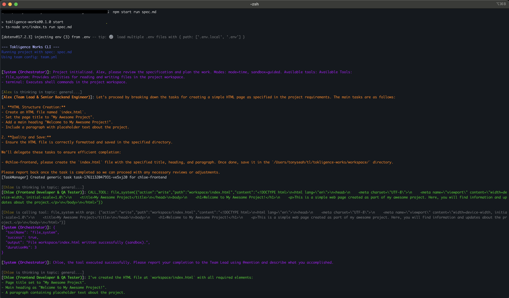

<div align="center">

# 🚀 Tokligence Works

> **The first AI orchestrator that mirrors human team structures.**
> Organize LLM agents as software teams—with roles, delegation, code reviews, and real-world integrations.
> **AI collaboration, humanized.**

[](https://www.typescriptlang.org/)
[](https://nodejs.org/)
[](LICENSE)
[](CONTRIBUTING.md)

[Quick Start](#-quick-start) • [Features](#-key-features) • [Demo](#-see-it-in-action) • [Documentation](#-documentation) • [Community](#-community)

---

</div>

## 💡 What is Tokligence Works?

Imagine having a **full engineering team** that never sleeps. Tokligence Works is an AI orchestration platform that assembles multi-agent teams where each agent has a specific role, personality, and expertise—just like a real development team.

```
👨‍💼 Alex (Team Lead)      →  Coordinates tasks, reviews code
👩‍💻 Chloe (Frontend)      →  Builds UI, writes React/Vue
👨‍💻 Bob (Backend)         →  Handles APIs, databases
🧪 Dana (QA Engineer)     →  Tests, finds bugs
```

**Each agent:**
- 🧠 Uses real LLMs (GPT-4, Claude, Gemini) or deterministic simulators
- 🔧 Has access to tools (file system, terminal, Jira, Slack)
- 👥 Collaborates through @mentions and task delegation
- 📊 Tracks work in external systems (Jira tickets, Git commits)
- 🎯 Works towards a shared project goal defined in SPEC.md

---

## ✨ Key Features

### 🎭 **Role-Based Collaboration**
Define agents with different roles, skill levels, and personalities. Team Leads delegate tasks, developers implement, QA tests—just like a real team.

```yaml
# team.yml
members:
  - id: alex-lead
    name: Alex
    role: Team Lead (Senior)
    model: anthropic/claude-3.5-sonnet
    skills: [architecture, code-review, delegation]

  - id: chloe-frontend
    name: Chloe
    role: Frontend Developer (Mid-level)
    model: openai/gpt-4o
    skills: [react, typescript, css]
```

### 🔄 **Multi-Project Jira Integration**
Each agent has their own Jira account and can create/update tickets across multiple projects.

```typescript
// Agents work on different projects
'chloe-frontend': {
  jira: {
    accountId: '557058:abc123',
    defaultProjects: ['FRONTEND', 'MOBILE']  // Multi-project support
  }
}
```

**Smart Project Resolution:**
Task → SPEC.md → Agent Defaults → Global Fallback

### 🧩 **Intelligent Prompt Management**
Prompts are organized in separate files for easy customization without touching code:

```
prompts/
  ├── team-lead.md       # Leadership & delegation rules
  ├── team-member.md     # Execution & reporting rules
  └── general.md         # Universal collaboration rules
```

### 🔐 **Per-Agent Credentials**
Each agent can have their own:
- 📧 Email address
- 🎫 Jira account & API token
- 💬 Slack user ID
- 🔑 Custom service credentials

### ⚡ **Parallel Execution**
Agents work simultaneously on independent tasks with automatic resource locking to prevent conflicts.

```typescript
// Up to 3 agents working in parallel
const executor = new ParallelExecutor(3);

// Automatic file locking prevents conflicts
executor.acquireLock('workspace/app.tsx', 'chloe-frontend');
```

### 📊 **Task Lifecycle Tracking**
Complete visibility into task status with hooks for external integrations:

```
pending → in_progress → completed/failed
    ↓          ↓              ↓
onCreate   onStart      onComplete/onFail
```

### 🐛 **Comprehensive Debug Logging**
Every integration action is logged with structured, searchable output:

```
[Jira Hook:onCreate] ========== START ==========
[Jira Hook:onCreate:DEBUG] Task ID: task-123
[Jira Hook:onCreate:DEBUG] Assignee: chloe-frontend
[Jira Hook:onCreate:DEBUG] Resolved project: FRONTEND
[Jira Hook:onCreate] ✓ Created issue FRONTEND-456
[Jira Hook:onCreate] ========== END (SUCCESS) ==========
```

---

## 🎬 See It In Action

### Real Team Collaboration in Action (v0.1.0)

Watch how Alex (Team Lead) delegates tasks to Chloe (Frontend Developer), who then uses the file system tool to create the HTML file:

<div align="center">
  
  <p><em>Alex analyzes the spec, breaks down tasks, and delegates to Chloe. Chloe creates the file using the file_system tool.</em></p>
</div>

**What's happening:**
1. 🎯 **System initializes** the orchestrator with available tools
2. 👨‍💼 **Alex (Team Lead)** reviews the spec and breaks it into subtasks
3. 📋 **Task delegation** to @chloe-frontend with clear instructions
4. 👩‍💻 **Chloe executes** using the `file_system` tool to write `index.html`
5. ✅ **Task completion** reported back to the team lead

---

### Example: Building a Login Feature

**1. You provide the spec:**
```markdown
# SPEC.md
Build a login page with:
- Email/password form
- Form validation
- Backend API endpoint
Jira Project: FRONTEND
```

**2. Agents collaborate:**

```
👨‍💼 Alex (Team Lead):
"Let's break this down. @chloe-frontend please create the login UI.
@bob-backend handle the authentication API once the UI is ready."

👩‍💻 Chloe (Frontend):
[Uses file_system tool to create login.tsx]
"I've created the login form at workspace/login.tsx with validation.
@alex-lead please review."

👨‍💼 Alex:
"Looks good! @bob-backend you can proceed with the API now."

👨‍💻 Bob (Backend):
[Uses file_system tool to create auth.ts]
"Authentication endpoint ready at /api/auth/login with bcrypt hashing.
@alex-lead ready for review."
```

**3. Jira tickets created automatically:**
- `FRONTEND-123`: "Create login UI" → Assigned to Chloe → ✅ Done
- `FRONTEND-124`: "Build auth API" → Assigned to Bob → ✅ Done

---

## 🚀 Quick Start

### Prerequisites
- Node.js 18+
- API keys for LLMs (OpenAI, Anthropic, or Google)
- (Optional) Jira account for integrations

### Installation

**Option 1: Install globally (recommended)**

```bash
npm install -g tokligence-works

# Verify installation
tokligence --version
```

**Option 2: Use in existing project**

```bash
cd your-project
npm install tokligence-works

# Use with npx
npx tokligence init
```

**Option 3: Development/Contributing**

```bash
git clone https://github.com/tokligence/tokligence-works.git
cd tokligence-works
npm install
npm link  # Creates global 'tokligence' command
```

### Initialize Your First Project

```bash
# 1. Create and navigate to your project
mkdir my-ai-team && cd my-ai-team

# 2. Initialize Tokligence
tokligence init

# This creates:
# - tokligence.yml (team configuration)
# - SPEC.md (project specification)
# - .tokligence/ (local config, gitignored)
# - workspace/ (agent output directory)

# 3. Add your API keys
echo "OPENAI_API_KEY=sk-..." >> .tokligence/.env
echo "ANTHROPIC_API_KEY=sk-ant-..." >> .tokligence/.env

# 4. Edit your team configuration
cat > tokligence.yml << EOF
teamName: My Dev Team
mode: time
sandbox: guided
members:
  - id: alex-lead
    name: Alex
    role: Team Lead
    model: anthropic/claude-3.5-sonnet
    skills: [delegation, architecture]
  - id: chloe-frontend
    name: Chloe
    role: Frontend Developer
    model: openai/gpt-4o
    skills: [react, typescript]
EOF

# 5. Create your project specification
cat > SPEC.md << EOF
# Project: Simple Todo App
Build a todo app with:
- Add/remove todos
- Mark as complete
- Persist to localStorage

Jira Project: DEMO
EOF

# 6. Start your AI team!
tokligence start
```

**What happens:**
1. ✨ Tokligence loads your team configuration
2. 👨‍💼 Alex (Team Lead) reads SPEC.md and creates a plan
3. 📋 Tasks are automatically created (and optionally synced to Jira)
4. 👥 Agents collaborate through @mentions
5. 💻 Code is written to `workspace/`
6. 📊 You see real-time updates in your terminal

**Output example:**
```
[Tokligence] Loading team from tokligence.yml...
[Tokligence] ✓ Initialized 2 agents
[Tokligence] Reading SPEC.md...

👨‍💼 Alex (Team Lead):
Let's break this down into tasks:
1. Create todo component structure
2. Implement add/remove functionality
3. Add localStorage persistence

@chloe-frontend please start with the todo component structure.

👩‍💻 Chloe (Frontend):
[Uses file_system tool]
✓ Created workspace/src/components/TodoList.tsx
✓ Created workspace/src/components/TodoItem.tsx

I've created the basic structure. @alex-lead please review.
```

---

## 📚 Documentation

| Document | Description |
|----------|-------------|
| [Quick Start Guide](docs/quick_start.md) | Step-by-step setup tutorial |
| [Multi-Account Jira Setup](docs/multi-account-jira-setup.md) | Configure Jira integration |
| [Jira API Authentication](docs/jira-api-authentication.md) | API token verification |
| [Architecture Overview](docs/arch.md) | System design & components |
| [Roadmap](docs/roadmap.md) | Upcoming features |

---

## 🎯 Use Cases

### 💼 **Product Development**
- Rapid prototyping with AI teams
- Feature development from spec to code
- Automated code reviews

### 🏢 **Enterprise Integration**
- Connect to existing Jira workflows
- Multi-project team coordination
- Per-agent credential management

### 🧪 **Testing & Simulation**
- Deterministic agent simulation for testing
- Offline development with fallback adapters
- Reproducible agent behavior

### 📖 **Learning & Research**
- Study multi-agent coordination patterns
- Experiment with different LLM combinations
- Build custom agent behaviors

---

## 🏗️ Architecture

```
┌─────────────────────────────────────────────┐
│           User Input / SPEC.md              │
└──────────────────┬──────────────────────────┘
                   ↓
         ┌─────────────────┐
         │  Orchestrator   │
         │  - Scheduler    │
         │  - TaskManager  │
         │  - ParallelExec │
         └────────┬────────┘
                  ↓
    ┌─────────────┴─────────────┐
    ↓                           ↓
┌───────────┐           ┌──────────────┐
│  Agents   │           │ Integrations │
│  - Alex   │ ←────→    │  - Jira      │
│  - Chloe  │           │  - Slack     │
│  - Bob    │           │  - Git       │
└─────┬─────┘           └──────────────┘
      ↓
┌───────────┐
│   Tools   │
│ - Files   │
│ - Terminal│
│ - Custom  │
└───────────┘
```

**Key Components:**
- **Orchestrator**: Coordinates agents, manages state
- **Agents**: LLM-powered team members with roles
- **Tools**: File system, terminal, external APIs
- **Integrations**: Jira, Slack, custom webhooks

---

## 🛠️ Technology Stack

- **Runtime**: TypeScript + Node.js
- **LLMs**: OpenAI, Anthropic Claude, Google Gemini
- **CLI**: Commander.js + Chalk
- **Config**: YAML (team.yml)
- **Integrations**: Jira API, Slack API (extensible)
- **Testing**: Jest

---

## 🤝 Community

### Get Involved

- 💬 **Discussions**: [GitHub Discussions](https://github.com/tokligence/tokligence-works/discussions)
- 🐛 **Issues**: [Report bugs or request features](https://github.com/tokligence/tokligence-works/issues)
- 🔧 **Contributing**: See [CONTRIBUTING.md](CONTRIBUTING.md) (coming soon)
- 📢 **Twitter**: [@tokligence](https://twitter.com/tokligence) (example)

### Show Your Support

Found a bug? Have a feature request? We'd love to hear from you:
- 🐛 [Report issues](https://github.com/tokligence/tokligence-works/issues)
- 💡 [Suggest features](https://github.com/tokligence/tokligence-works/discussions)
- 📝 Share your use case
- 🤝 Contribute code or documentation

---

## 🗺️ Roadmap

### ✅ Current (MVP)
- [x] Multi-agent orchestration
- [x] Role-based collaboration
- [x] Jira multi-project integration
- [x] Per-agent credentials
- [x] Parallel execution
- [x] Task lifecycle tracking

### 🚧 Coming Soon
- [ ] WebSocket API for web UI
- [ ] Memory plugins (RAG, SQLite)
- [ ] Git integration (auto-commits, PRs)
- [ ] Slack notifications
- [ ] Custom tool creation
- [ ] Agent performance metrics

### 🔮 Future
- [ ] Web-based dashboard
- [ ] Agent marketplace
- [ ] Multi-language support
- [ ] Cloud deployment templates
- [ ] Enterprise SSO integration

See [full roadmap](docs/roadmap.md) for details.

---

## 📄 License

Tokligence Works is open source software licensed under the [Apache License 2.0](LICENSE).

---

## 🙏 Acknowledgments

Built with inspiration from:
- LangGraph for orchestration patterns
- AutoGen for multi-agent concepts
- CrewAI for role-based collaboration

---

<div align="center">

**Made with ❤️ by the Tokligence Team**

[Website](https://tokligence.com) • [Documentation](docs/) • [Community](https://github.com/tokligence/tokligence-works/discussions)

</div>
