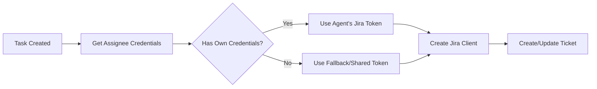

# Multi-Account Jira Integration Setup Guide

This guide explains how to set up Jira integration where **each agent has their own Jira account** with separate email addresses and API tokens.

## Overview

The multi-account design allows:
- ✅ Each agent authenticates with their own Jira account
- ✅ Tickets are automatically assigned to the correct agent in Jira
- ✅ Proper audit trails showing who did what
- ✅ Individual API rate limits per agent
- ✅ Flexible fallback to shared credentials if needed

## Architecture

```
┌─────────────────┐
│ TaskManager     │
│  + hooks        │
│  + credentials  │
└────────┬────────┘
         │
         ├─ onCreate(TaskHookContext)
         │   ├─ task: Task
         │   ├─ assigneeCredentials: AgentCredentials (Chloe's)
         │   └─ assignerCredentials: AgentCredentials (Alex's)
         │
         └─> JiraClientFactory
              └─> Creates JiraClient with assignee's credentials
                   └─> Creates ticket assigned to assignee
```

## Step 1: Configure Agent Credentials

### Option A: Using Configuration File (Recommended)

1. Copy the example file:
```bash
cp config/agent-credentials.example.json config/agent-credentials.json
```

2. Fill in actual credentials in `config/agent-credentials.json`:
```json
{
  "chloe-frontend": {
    "email": {
      "address": "chloe@company.com"
    },
    "jira": {
      "email": "chloe@company.com",
      "accountId": "557058:abc123",
      "apiToken": "ATATxxxxxxxxxxxx"
    }
  },
  "bob-backend": {
    "email": {
      "address": "bob@company.com"
    },
    "jira": {
      "email": "bob@company.com",
      "accountId": "557058:def456",
      "apiToken": "ATATyyyyyyyyyyyy"
    }
  }
}
```

3. Load in your code:
```typescript
import { AgentCredentialsManager } from './config/AgentCredentials';
import * as fs from 'fs';

const credentialsManager = new AgentCredentialsManager();
const credsConfig = JSON.parse(
  fs.readFileSync('./config/agent-credentials.json', 'utf-8')
);
credentialsManager.loadFromConfig(credsConfig);
```

### Option B: Using Environment Variables

Set environment variables for each agent:

```bash
# Chloe's credentials
export AGENT_CHLOE_FRONTEND_EMAIL=chloe@company.com
export AGENT_CHLOE_FRONTEND_JIRA_EMAIL=chloe@company.com
export AGENT_CHLOE_FRONTEND_JIRA_ACCOUNT_ID=557058:abc123
export AGENT_CHLOE_FRONTEND_JIRA_API_TOKEN=ATATxxxxxxxxxxxx

# Bob's credentials
export AGENT_BOB_BACKEND_EMAIL=bob@company.com
export AGENT_BOB_BACKEND_JIRA_EMAIL=bob@company.com
export AGENT_BOB_BACKEND_JIRA_ACCOUNT_ID=557058:def456
export AGENT_BOB_BACKEND_JIRA_API_TOKEN=ATATyyyyyyyyyyyy

# Alex's credentials
export AGENT_ALEX_LEAD_EMAIL=alex@company.com
export AGENT_ALEX_LEAD_JIRA_EMAIL=alex@company.com
export AGENT_ALEX_LEAD_JIRA_ACCOUNT_ID=557058:ghi789
export AGENT_ALEX_LEAD_JIRA_API_TOKEN=ATATzzzzzzzzzzzz
```

Then load in code:
```typescript
const credentialsManager = new AgentCredentialsManager();
credentialsManager.loadFromEnvironment([
  'chloe-frontend',
  'bob-backend',
  'alex-lead'
]);
```

## Step 2: Get Jira Credentials

### Finding Your Jira Account ID

1. Go to your Jira instance
2. Click on your profile picture → Profile
3. Look at the URL: `https://your-domain.atlassian.net/jira/people/557058:abc123`
4. The Account ID is: `557058:abc123`

### Generating API Token

1. Visit: https://id.atlassian.com/manage-profile/security/api-tokens
2. Click "Create API token"
3. Give it a name (e.g., "Tokligence Agent Token")
4. Copy the token (starts with `ATAT...`)
5. Store securely - you won't be able to see it again!

## Step 3: Set Up Jira Integration

```typescript
import { Orchestrator } from './orchestrator/Orchestrator';
import { AgentCredentialsManager } from './config/AgentCredentials';
import { createMultiAccountJiraHooks } from './integrations/jira-example';

// 1. Create orchestrator
const orchestrator = new Orchestrator(teamConfig, projectSpec, workspaceDir);
await orchestrator.initialize();

// 2. Set up credentials
const credentialsManager = new AgentCredentialsManager();
credentialsManager.loadFromEnvironment([
  'chloe-frontend',
  'bob-backend',
  'alex-lead'
]);

// 3. Connect credentials to TaskManager
orchestrator.getTaskManager().setCredentialsManager(credentialsManager);

// 4. Create and register Jira hooks
const jiraHooks = createMultiAccountJiraHooks(
  'your-domain.atlassian.net',
  'PROJ' // Your Jira project key
);
orchestrator.getTaskManager().registerHooks(jiraHooks);

// 5. Start orchestrator
await orchestrator.start();
```

## How It Works

### Task Creation Flow

```
1. Alex (Team Lead) delegates task to Chloe:
   "@chloe-frontend please create the login page"

2. TaskManager.createTask() is called:
   - assignee: 'chloe-frontend'
   - assignedBy: 'alex-lead'

3. onCreate hook receives TaskHookContext:
   {
     task: { assignee: 'chloe-frontend', ... },
     assigneeCredentials: {
       jira: {
         email: 'chloe@company.com',
         accountId: '557058:abc123',
         apiToken: 'ATATxxxx'
       }
     },
     assignerCredentials: {
       jira: { ... } // Alex's credentials
     }
   }

4. JiraClientFactory creates client with Chloe's credentials:
   - Authentication uses Chloe's email + API token
   - Ticket assignee set to Chloe's account ID

5. Jira ticket created:
   - Reporter: Chloe (authenticated user)
   - Assignee: Chloe
   - All future updates use Chloe's credentials
```

### Authentication Flow



## Security Best Practices

### ✅ DO:
- Store credentials in environment variables or encrypted config files
- Add `config/agent-credentials.json` to `.gitignore` (already done)
- Use personal API tokens, not shared accounts
- Rotate tokens regularly (every 90 days)
- Use environment-specific tokens (dev/staging/prod)

### ❌ DON'T:
- Commit actual credentials to version control
- Share API tokens between agents
- Use account passwords instead of API tokens
- Store tokens in plaintext in public locations

## Troubleshooting

### Issue: "403 Forbidden" when creating tickets

**Cause**: API token doesn't have permissions

**Solution**:
1. Verify the token is correct
2. Check that the Jira account has "Create Issues" permission
3. Verify the project key is correct

### Issue: Tickets created but not assigned

**Cause**: Account ID is incorrect or user doesn't have access to project

**Solution**:
1. Double-check the Account ID format: `557058:abc123`
2. Verify the user is a member of the Jira project
3. Check project permissions allow assigning issues

### Issue: Agent has no credentials

**Cause**: Credentials not loaded or agent ID mismatch

**Solution**:
1. Check agent ID matches exactly (case-sensitive)
2. Verify credentials are loaded before hooks are registered
3. Check console for `[AgentCredentials] Loaded credentials for...` messages

## Testing Without Real Jira

The system uses a `MockJiraClient` by default, which logs to console:

```
[Jira Mock chloe@company.com] Creating issue: Create login page
  - Assignee: 557058:abc123
[Jira Mock chloe@company.com] Transitioning PROJ-123 to: In Progress
```

To use real Jira:
1. Install: `npm install jira-client`
2. Uncomment the JiraClient code in `jira-example.ts`
3. Configure credentials as described above

## Advanced Configuration

### Per-Agent Jira Hosts

If agents work on different Jira instances:

```json
{
  "chloe-frontend": {
    "jira": {
      "host": "team-a.atlassian.net",
      "apiToken": "..."
    }
  },
  "bob-backend": {
    "jira": {
      "host": "team-b.atlassian.net",
      "apiToken": "..."
    }
  }
}
```

### Custom Fields

Add custom data for your integrations:

```json
{
  "chloe-frontend": {
    "jira": { ... },
    "custom": {
      "department": "Frontend",
      "location": "US-West",
      "costCenter": "ENG-001"
    }
  }
}
```

Access in hooks:
```typescript
const department = context.assigneeCredentials?.custom?.department;
```

## Next Steps

- Set up Slack integration similarly (see `SlackCredentials` interface)
- Add email notifications using agent email addresses
- Extend to other project management tools (Asana, Linear, etc.)
- Implement credential rotation automation
